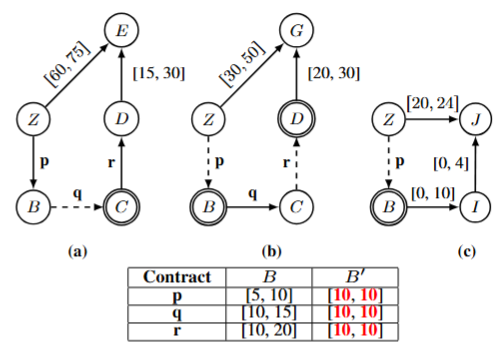

# Multi-agent Interdependent Simple Temporal Networks under Uncertainty (MISTNU): The repair problem

Multi-Agent Interdependent Simple Temporal Networks under Uncertainty (MISTNU) extends the classical STNU framework to multi-agent contexts that fit decentralized multi-agent planning, where each agent plans its own course of action while coordinating through mutual commitments. In this model, the duration of certain constraints is determined by one agent but observed by others. In these scenarios, such constraints are considered contingent, according to STNU semantics. This gives rise to cases where some contingent durations are negotiable, meaning their intervals can be reduced in advance through coordination. The MISTNU model explicitly represents these constraints as contracts. For a detailed introduction to MISTNU, the reader is referred to the original paper: Ajdin Sumic, Thierry Vidal, Andrea Micheli, Alessandro Cimatti, Introducing Interdependent Simple Temporal Networks with Uncertainty for Multi-Agent Temporal Planning, TIME 2024.

An important aspect of the MISTNU framework is the notion of controllability, which varies depending on when the duration of a contract becomes available. Weak Controllability assumes that contract durations are revealed just before execution. Dynamic Controllability assumes they are observed during execution, possibly with limited foresight through oracles. Strong Controllability assumes that durations are never revealed or shared. Verifying controllability at any level in a MISTNU requires all individual agent networks to be controllable at that level.

When a MISTNU is not controllable, it is often possible to restore controllability by reducing the intervals of contract durations. This work introduces new centralized and distributed algorithms to repair MISTNUs that are not weakly controllable. These methods are part of a paper currently under review for ECAI 2025, and a citation will be provided once acceptance is confirmed.

In the following, we present a concrete and realistic example of the MISTNU model. We begin by assigning duration intervals to the contracts that make the network not Weakly Controllable (column B). Then, we show updated bounds (column B′) that restore Weak Controllability, thereby repairing the MISTNU. Note that the only repairs are the ones that reduced all contracts to a singleton, i.e, directly fixed thir durations.

# Example

Consider a radiologist (agent a), a nurse (agent b), and a doctor (agent c). The radiologist must perform an X-ray on a patient, after which the doctor analyzes the results to prescribe medication. Meanwhile, the nurse waits for the X-ray to finish in order to escort the current patient to the waiting room and bring a second patient to the radiologist. This scenario involves three contracts: (p) the X-ray of the first patient, which is contingent for both the nurse and the doctor, (q) the nurse bringing the second patient to the radiologist, making it contingent for the radiologist, (r) the nurse waiting for the second X-ray to complete before moving the patient to another waiting room. After the second X-ray, the radiologist must clean and inspect the equipment as required by regulation.

# Folder

The folder contains four repair algorithms: \\
    - "SMT_WC", which is the centralized SMT-based algorithm that encode the problem as a formula to solve for the case of Weak Controllability \\
    - "SMT_SC", which is the centralized SMT-based algorithm that encode the problem as a formula to solve for the case of Strong Controllability
    - "linear_cycles", which is a centralized repair algorithm that gathers negative cycles from all networks and resolves them using a linear encoding
    - "SBT", which is a distributed repair algorithm that distributes the relevant negative cycles to the respective agents and repairs them using an enhanced SBT-based approach (Synchronuous Backtracking algorithm).

#  Requirements

This project requires the pySMT framework to be installed, which can be found here: https://github.com/pysmt/pysmt 
In addition, we require installing the optimization package of the pySMT framework: pip install git+https://github.com/pysmt/pysmt.git@optimization

# Run

To run the proposed algorithm for repairing MISTNUs, you must run the main.py file by providing a test file with the --inputFile parameter, the method with the --solver parameter (either "SMT", "SBT", or "linear_cycle"), and the optimization function with --optim(not mandatory but see to following to use them). 
We propose four optimization functions :
  - the "min_k_budget" that minimizes the reduction of the contracts
  - the "fairness_contract" that minimizes the reduction of the contracts and maximizes the number of contracts that are reduced by the same amount
  - the "k-contract" that minimizes the number of contracts that are reduced
  - the "fairness_agent" that minimizes the reduction of the contracts and maximizes the number of agent that reduced their flexibility by the same amount, i.e., the sum of the reduction of the contracts it owns

Here is an example with the proposed example that can be found in the demofile_WC.txt:

python3 ./main --inputFile ../benchmark/demofile_WC.txt --solver SMT_WC --optim k-contract

# Collaborators

- Ajdin Sumic
- Roberto Posenato
- Thierry Vidal
- Carlo Combi
- Frédéric Maris
- Andrea Micheli
- Alessandro Cimatti

